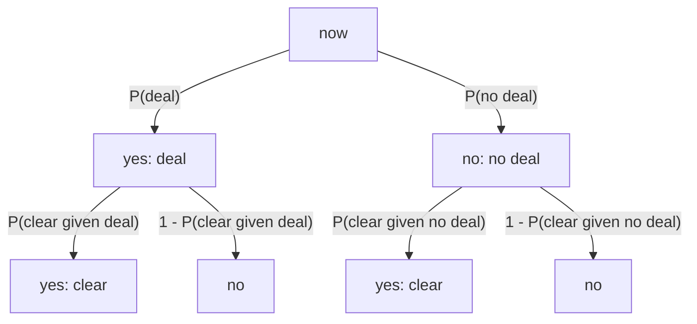

# Paths from now to the query

The query probability is the sum of the path products into the yes destinations. Each situation's yes and no edges sum to 1.

P(reopen) = P(deal) * P(clear | deal) + P(no deal) * P(clear | no deal)
          = 0.0206

# Schema

(:Case {case_id})<-[:BELONGS_TO]-(:Situation {situation_id, desc, kind})-[:LEADS_TO {p, inputs}]->(:Situation)
