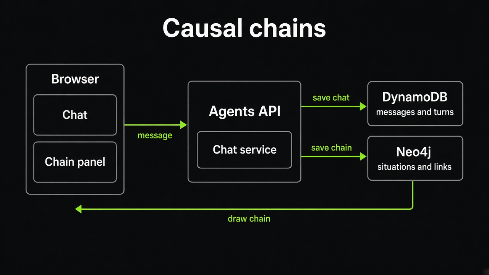
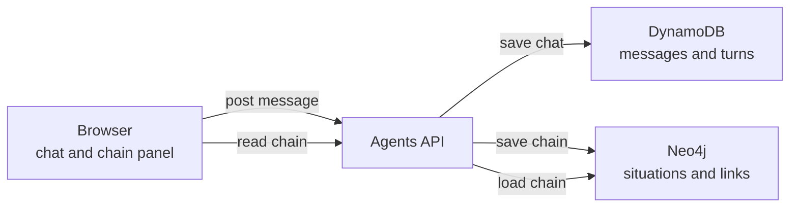
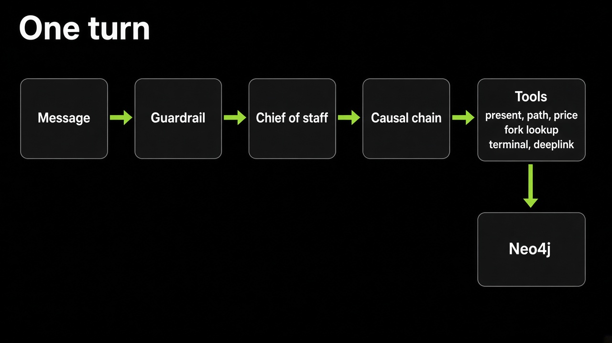
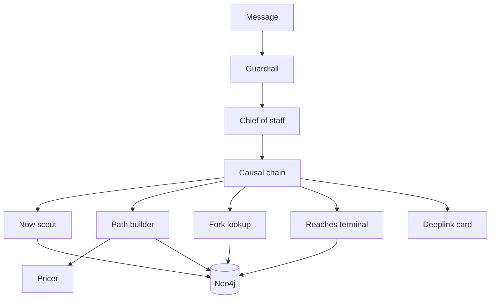
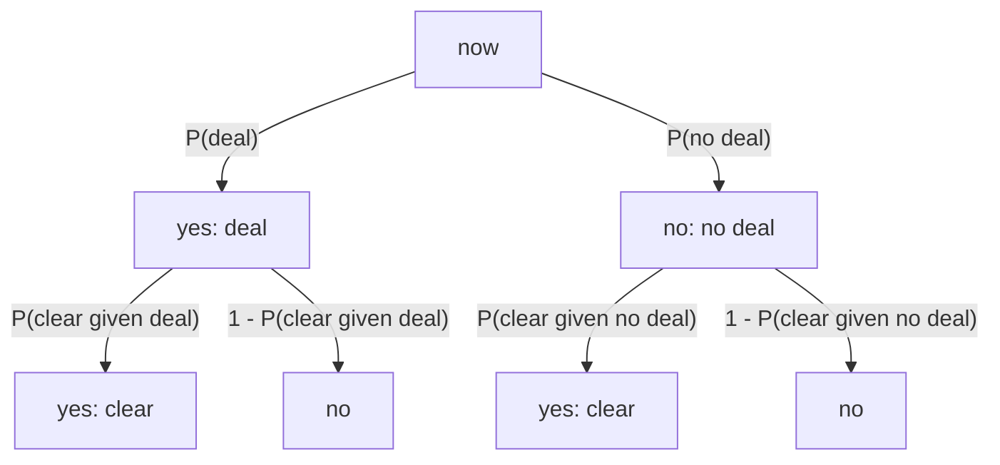

# Causal chains

A chat asks a hypothetical. The agents API builds a chain of situations from the present to that future and stores it in Neo4j. The browser draws that chain beside the chat.

## Where it runs

The browser talks only to the agents API. The API saves the conversation in DynamoDB and the chain in Neo4j. The chain panel reads that chain back through the same API.

## One turn

The guardrail reads the message first. The chief of staff hands a hypothetical to the causal chain. That chain finds the present, takes one priced step at a time, and can fork from the parent of a named situation toward the terminal already on the case. When a path reaches that terminal, it emits a deeplink card in the chat.

Now scout and the path builder save situations and links. Fork lookup and reaches terminal read them. The pricer names the inputs on one link. The deeplink is a card in the chat, not a node in the graph.

# Paths from now to the query

The query probability is the sum of the path products into the yes destinations. Each situation's yes and no edges sum to 1.

P(reopen) = P(deal) * P(clear | deal) + P(no deal) * P(clear | no deal)
          = 0.0206

# Schema

(:Case {case_id})<-[:BELONGS_TO]-(:Situation {situation_id, desc, kind})-[:LEADS_TO {p, inputs}]->(:Situation)
