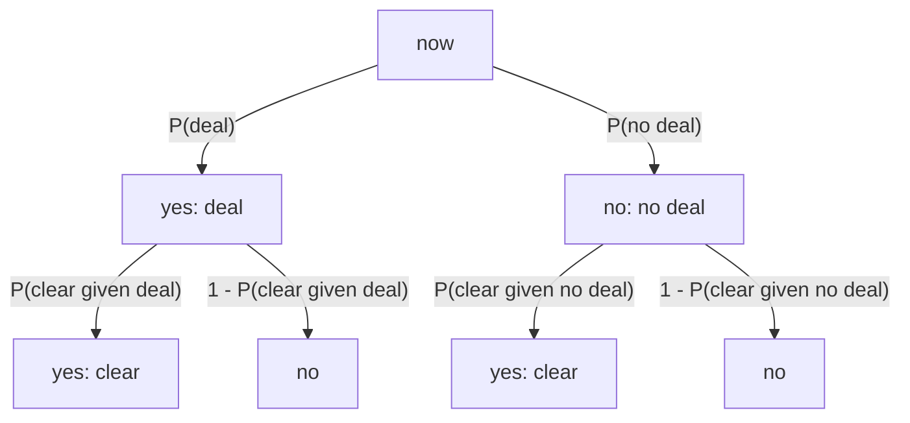

# Paths from now to the query

The query probability is the sum of the path products into the destination events. A situation may lead to more than two next situations. The outgoing probabilities of one situation still sum to 1.

P(reopen) = P(deal) * P(clear | deal) + P(no deal) * P(clear | no deal)
          = 0.0206

The same sum works when a situation has three or more next events. Each edge stores inputs (a base rate and evidence log-odds). Code derives `p`, then divides by the sibling sum.

Depth is the hop count from the root. The editor assigns it. A destination must be at least `min_depth` hops down, and `add_event` rejects a hop past `max_depth`.

# Schema

The agent working set is an in-memory `CausalChain`. Agents get and set it. They do not emit the graph.

The stored row shape is still:

(:Situation {situation_id, desc, is_root})-[:LEADS_TO {p}]->(:Situation)
