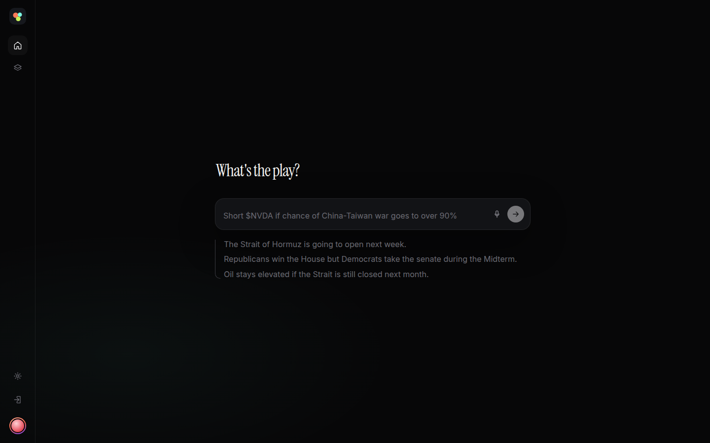
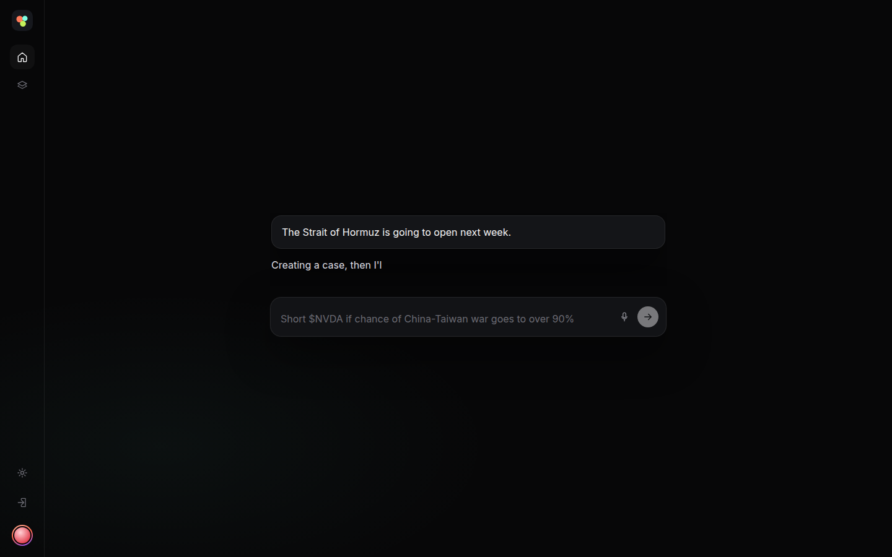
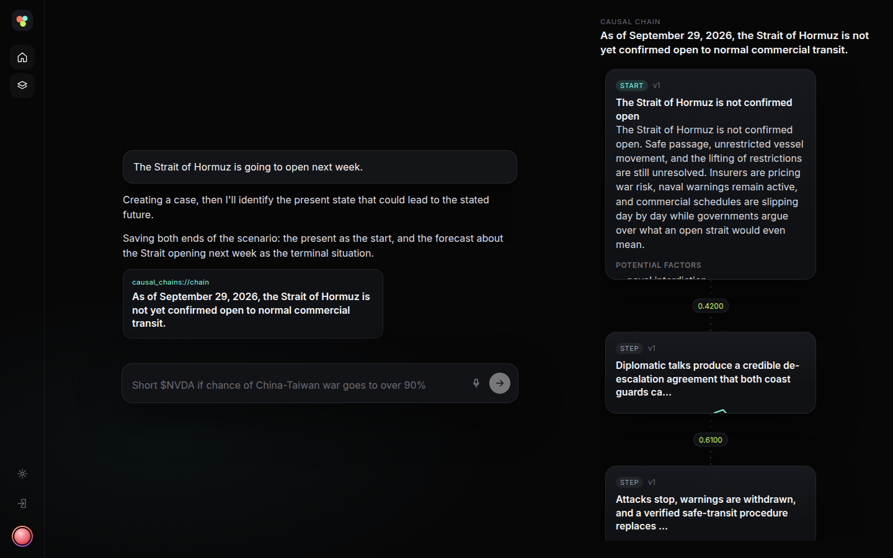
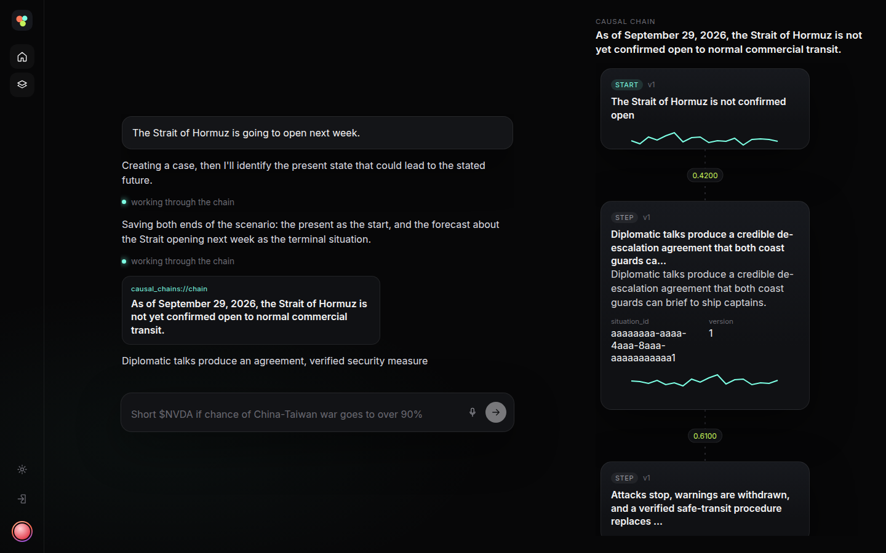
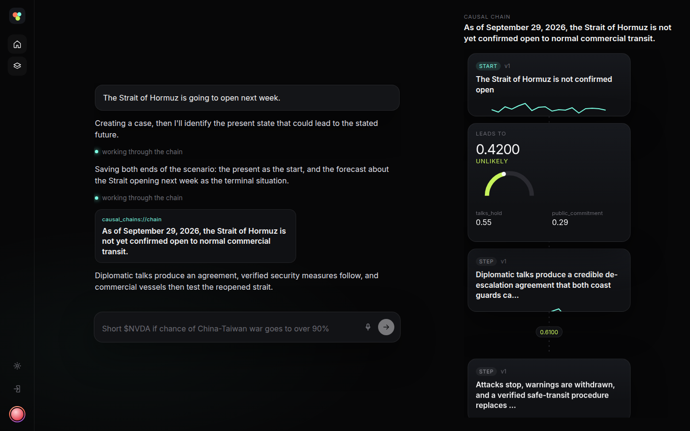
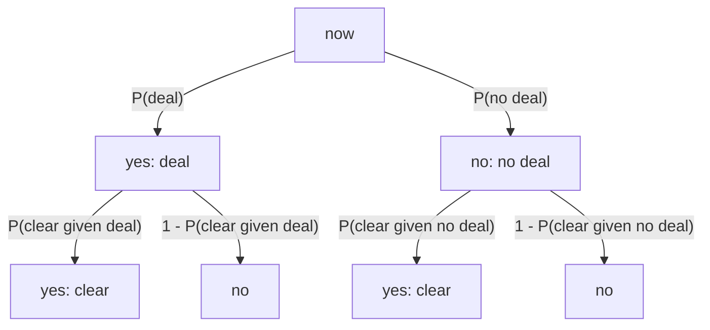

# Demo

The chat sits in the center. The chain panel stays folded until a `causal_chains://` link is ready. From `web/`, open `/?demo=1` to play the Hormuz turn.

The next paragraph waits until the current one has finished animating.

The panel then unfolds beside the chat.

A situation opens into a scrolling card and pushes the other nodes aside.

An edge does the same for its probability and inputs.

[Recording](web/e2e/shots/chat-chain.webm)

# Paths from now to the query

The query probability is the sum of the path products into the yes destinations. Each situation's yes and no edges sum to 1.

P(reopen) = P(deal) * P(clear | deal) + P(no deal) * P(clear | no deal)
          = 0.0206

# Schema

(:Case {case_id})<-[:BELONGS_TO]-(:Situation {situation_id, desc, kind})-[:LEADS_TO {p, inputs}]->(:Situation)
