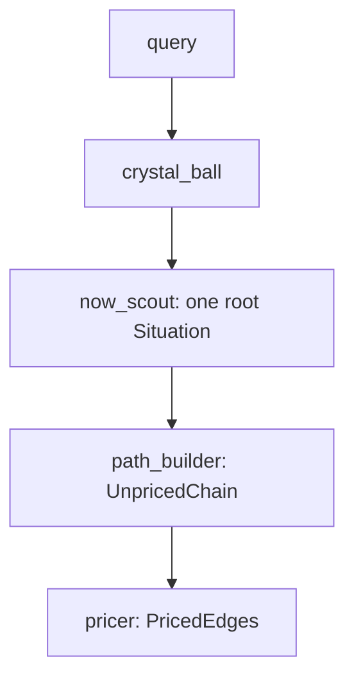

# Agent control flow

`crystal_ball` is the host. It must not invent a present, a path, or a probability.

- `now_scout` searches the web and returns one root `Situation`. No paths, no `p`.
- `path_builder` searches the web and returns at least two paths to the query, plus the failure branch on every split. Destinations are dated yes-or-no sentences. No `p`.
- `pricer` searches the web for base rates and sets `p` on the edges it was given. Outgoing edges from one situation sum to 1. It does not add or delete a situation.
- `crystal_ball` calls those three tools in one run. It does not return a `ChainGraph`.
