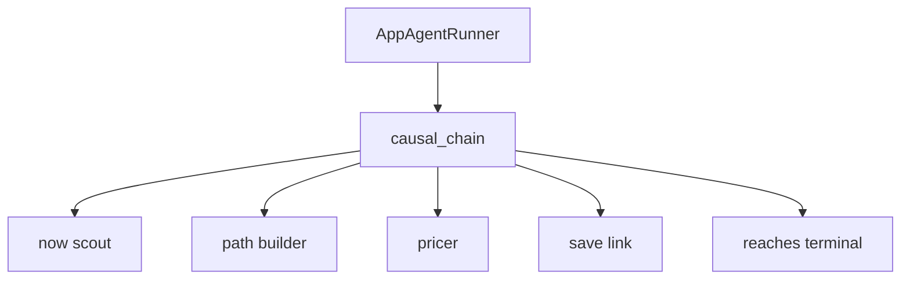

# Agent control flow

`causal_chain` is the only agent the runner calls. It must not invent a present, a path, or a probability.

- The runner passes the future and the remaining attempts. It does not call the store.
- Now scout saves the present and returns that situation. The id is assigned when it is saved. The description includes the sources behind it.
- Path builder saves at most one next situation. The request is the current situation, the terminal, a direction, and the remaining quota. An empty result means the next hop is the terminal. The new description changes one variable.
- The pricer names the input variables on that one link, and the link tool saves the link. The stored probability is the mean of those inputs.
- The agent stops when a path runs from the start to the terminal, then returns the stored root situation.
