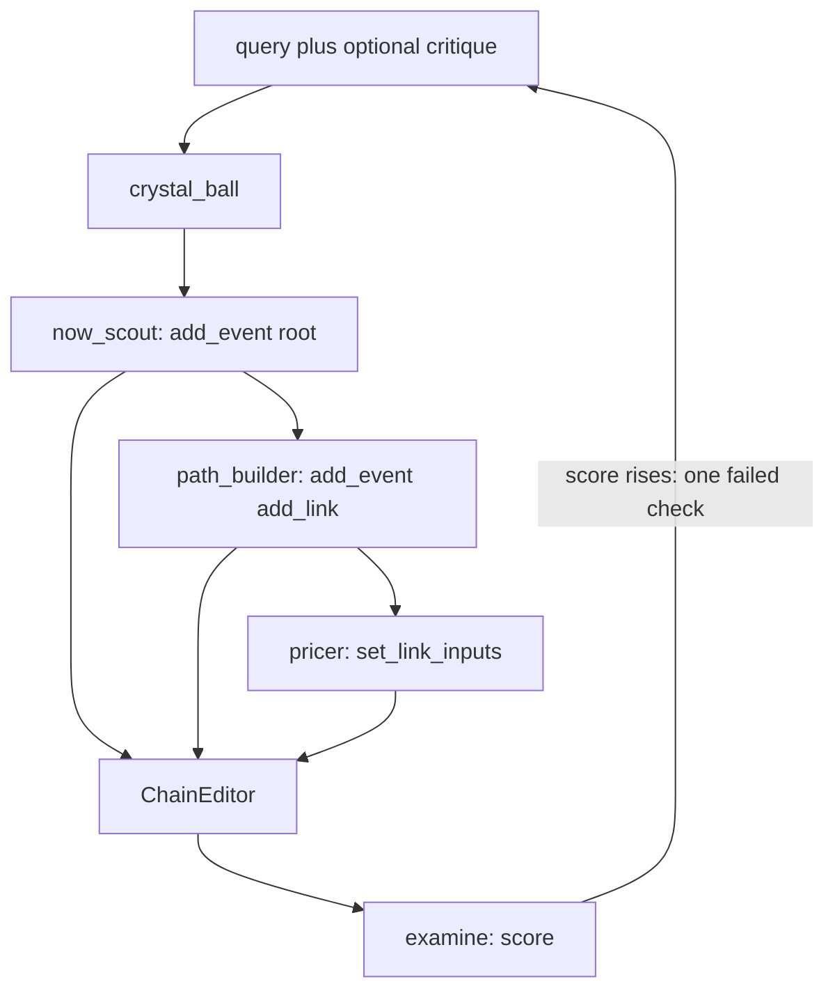

# Agent control flow

`crystal_ball` is the host. It must not invent a present, a path, or a probability. A critique in the input is the single fix for that run. `examine` is code, not an agent. The outer keep-or-retry loop is [hill-climb](../../.agents/hill-climb/SKILL.md).

One `ChainEditor` holds the `CausalChain` for a run. Sub-agents share it. They read and write through tools. They do not return the chain. `p` is not a tool argument. Code derives it from link inputs, then normalizes siblings so they sum to 1. Each of the 3 retries gets a new chain.

- `now_scout` searches the web and calls `add_event` once for the root. No links, no inputs.
- `path_builder` searches the web and calls `add_event`, `add_link`, and `mark_destination`. A cause may lead to more than two effects. The editor rejects a hop past max depth and a cause past max children. Destinations are dated yes-or-no sentences. No inputs, no `p`.
- `pricer` searches the web for base rates and calls `set_link_inputs` on links that are missing inputs or stale. It does not add or delete an event. It does not pass `p`.
- `crystal_ball` calls the three sub-agents, then `get_chain`. If an outgoing sum is not 1, it calls `pricer` again with that error.
- `examine` scores the chain from 0 to 5. Hill-climb keeps a chain only when the score rises, sends one failed check back as the critique, and stops when the score does not rise or after 3 runs.
