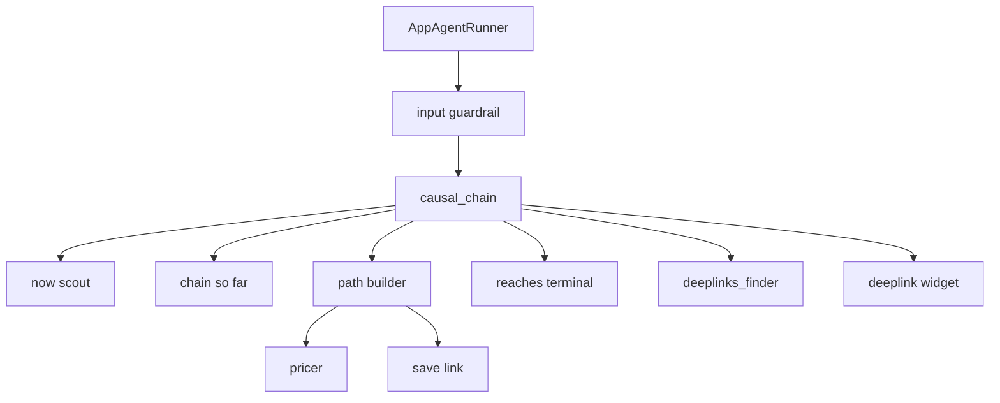

# Agent control flow

`causal_chain` is the only agent the runner calls. An input guardrail checks the message before that agent starts. The causal chain must not invent a present, a path, or a probability.

- The runner passes the future and the remaining attempts. It does not call the store.
- The input guardrail reads that same message first. It stops the run when the message is a prompt injection or a probe for system information.
- Now scout saves the present and returns that situation. The id is assigned when it is saved. The description includes the sources behind it.
- Before each path step, the causal chain loads the open line from the present through the current situation, including each saved link, and puts that line in the direction.
- Path builder takes one step. It either links the current situation to the terminal, or saves one next situation and links the current situation to it. The pricer names the input variables on that one link. The stored probability is the mean of those inputs.
- After a path runs from the start to the terminal, find the in-app destination for the current case and a description of what the reader should open. The route is `/chain/<case_id>`, the scheme is `causal_chains`, params are empty, and there is no version.
- Write the story of how the current situation evolves to the asked situation, then emit a deeplink card widget. The runner turns that card into a chat message.
