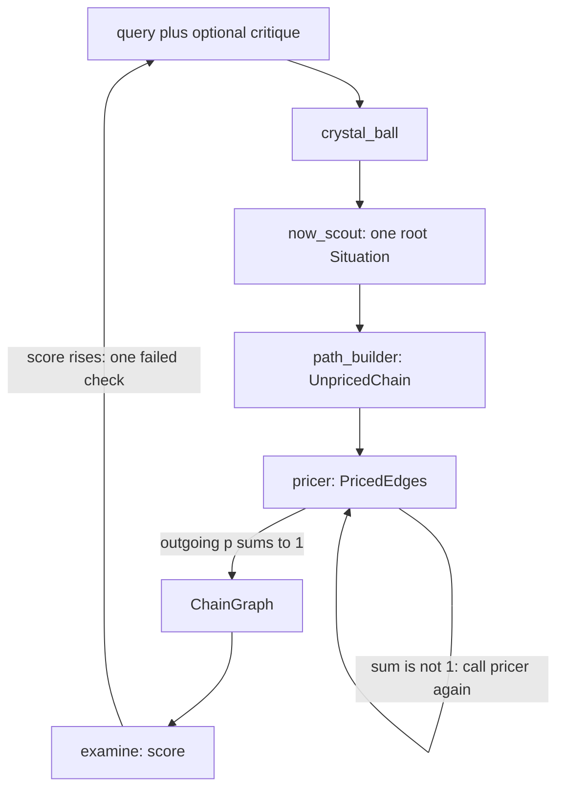

# Agent control flow

`crystal_ball` is the host. It must not invent a present, a path, or a probability. A critique in the input is the single fix for that run. `examine` is code, not an agent. The outer keep-or-retry loop is [hill-climb](../../.agents/hill-climb/SKILL.md).

- `now_scout` searches the web and returns one root `Situation`. No paths, no `p`.
- `path_builder` searches the web and returns at least two paths to the query, plus the failure branch on every split. Destinations are dated yes-or-no sentences. No `p`.
- `pricer` searches the web for base rates and sets `p` on the edges it was given. Outgoing edges from one situation sum to 1. It does not add or delete a situation.
- `crystal_ball` returns `ChainGraph`. If an outgoing sum is not 1, it calls `pricer` again with that error.
- `examine` scores the graph from 0 to 5. Hill-climb keeps a graph only when the score rises, sends one failed check back as the critique, and stops when the score does not rise or after 3 runs.
