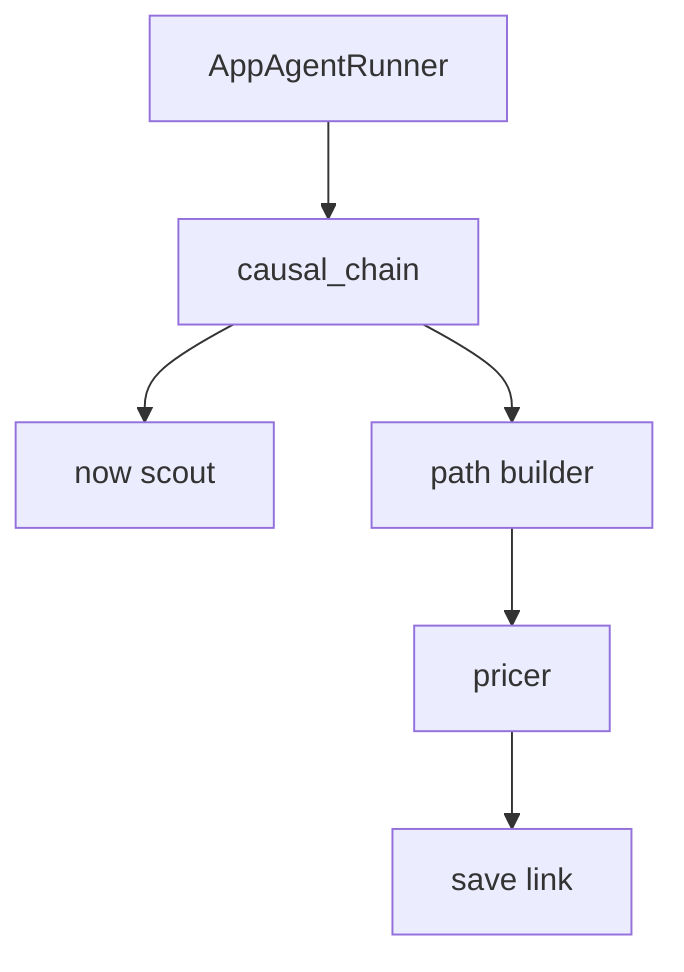

# Agent control flow

`causal_chain` is the only agent the runner calls. It must not invent a present, a path, or a probability.

- The runner passes the future and the remaining attempts. It does not call the store.
- Now scout saves the present and returns that situation. The id is assigned when it is saved. The description includes the sources behind it.
- Path builder saves the next situations from the current description, the user's ask, and thoughts about how many attempts remain. While the chain is still open it returns those situations. When one states the ask, it returns that terminal situation.
- For every next situation, the pricer names the input variables on that one link, and the link tool saves the link between the two saved situations. The stored probability is the mean of those inputs.
- The agent returns the terminal situation.
