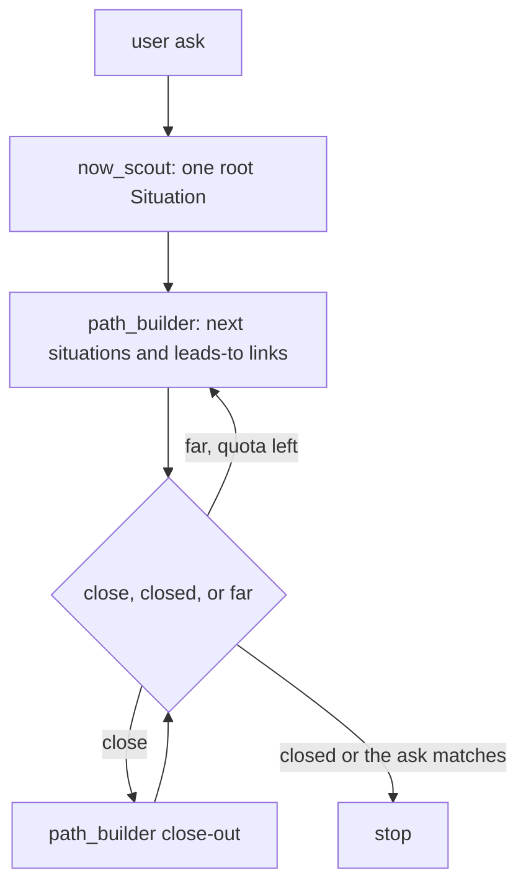

# Agent control flow

The runner is the host. It must not invent a present, a path, or a probability.

- `now_scout` searches the web and returns one root `Situation`. The runner stores it. No paths, no `p`.
- `path_builder` searches the web. Its tools write the next situations and the leads-to links. Each link's inputs are the variables a person can move later. `p` is the mean of those inputs. It returns the new situations and progress: `far`, `close`, or `closed`.
- `close` asks `path_builder` once more, to write the situations and links that close the path. That call spends quota.
- The loop stops when progress is `closed`, a situation desc is the user ask, or `attempt_quota` is spent.
