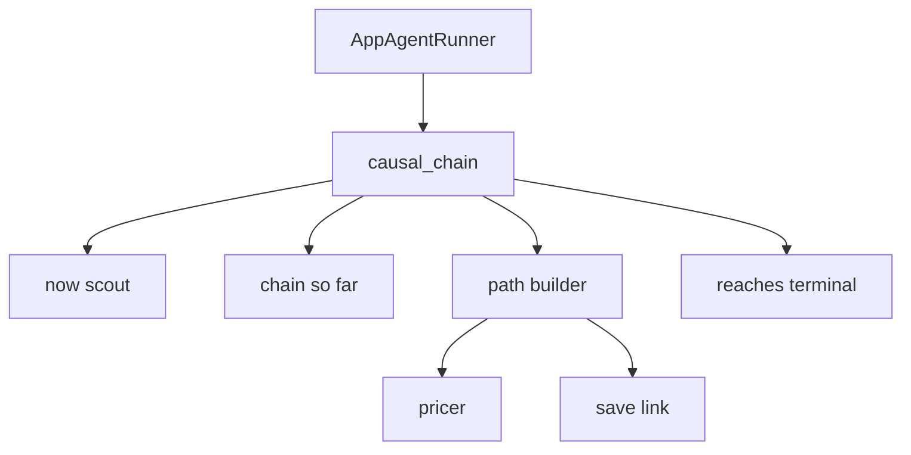

# Agent control flow

`causal_chain` is the only agent the runner calls. It must not invent a present, a path, or a probability.

- The runner passes the future and the remaining attempts. It does not call the store.
- Now scout saves the present and returns that situation. The id is assigned when it is saved. The description includes the sources behind it.
- Before each path step, the causal chain loads the open line from the present through the current situation, including each saved link, and puts that line in the direction.
- Path builder takes one step. It either links the current situation to the terminal, or saves one next situation and links the current situation to it. The pricer names the input variables on that one link. The stored probability is the mean of those inputs.
- The agent stops when a path runs from the start to the terminal, then returns the stored root situation.
