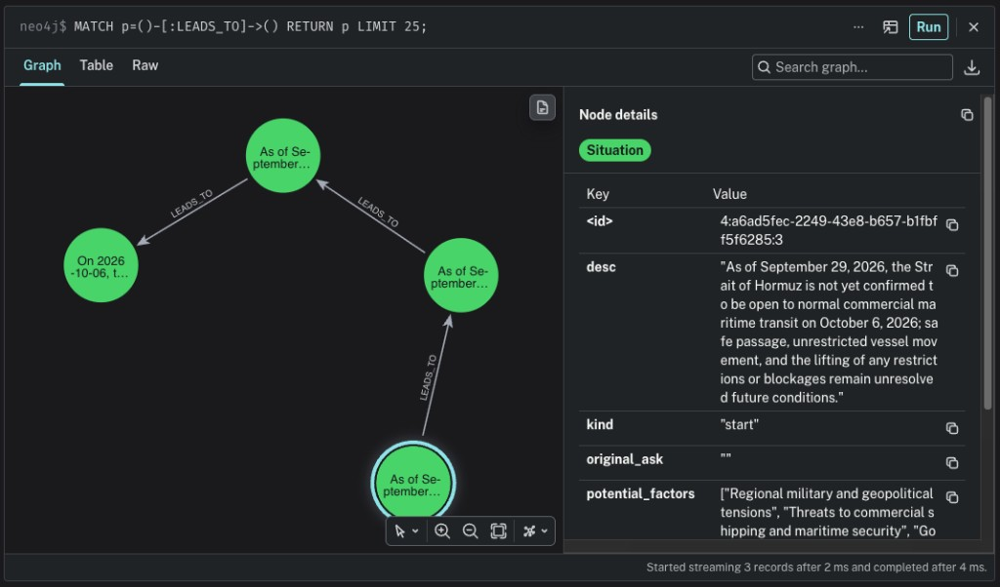

# Test run

Query: `The Strait of Hormuz is going to open next week.`

```bash
cd take_home/causal_chains
just eval-offline 'The Strait of Hormuz is going to open next week.'
```

The run clears situations already in Neo4j, then prints each reader message as it arrives. Open `http://localhost:7474` and run:

```cypher
MATCH p=()-[:LEADS_TO]->() RETURN p LIMIT 25;
```

That query streamed 3 `LEADS_TO` records across 4 situations. The saved start stayed `kind: "start"`:



> As of September 29, 2026, the Strait of Hormuz is not yet confirmed to be open to normal commercial maritime transit on October 6, 2026; safe passage, unrestricted vessel movement, and the lifting of any restrictions or blockages remain unresolved future conditions.

The reader link for that start is `/chain/99b353e5-0f01-4fcc-b78e-89b1b4233f46/1`.

## Run log

```
event: markdown
data: {"message_id":"91285872-fbe6-4729-8519-066aa724155c","role":"agent","text":"I’m creating a case, then I’ll identify the present state that could lead to the stated future."}

event: heartbeat
data: {"message_id":"382723f0-2dbc-4a44-a63f-bfd6d0a6b3d8","role":"meta"}

event: markdown
data: {"message_id":"445a9c18-f72f-4cd9-bab7-ba0072ccc58e","role":"agent","text":"I’m saving both ends of the scenario: the present as the starting point and the forecast about the Strait of Hormuz opening next week as the terminal situation."}

event: heartbeat
data: {"message_id":"8d2e94b3-4a48-4f30-baf8-a8dcde4ab39a","role":"meta"}

event: heartbeat
data: {"message_id":"0b346c43-a730-4059-bc96-3e3019a1990d","role":"meta"}

event: heartbeat
data: {"message_id":"a6f18048-c562-4132-80e0-9de4108875fd","role":"meta"}

event: markdown
data: {"message_id":"817ff324-5110-42c3-9244-fa850a6b5763","role":"agent","text":"I’m checking the open chain, then I’ll take the first causal step toward the reopening and validate the connection."}

event: heartbeat
data: {"message_id":"7bf3de64-61fb-4091-94d3-57b84cf95992","role":"meta"}

event: heartbeat
data: {"message_id":"08242678-da01-4377-bf9b-6db2214f18b1","role":"meta"}

event: heartbeat
data: {"message_id":"663997b5-c309-4658-a5c1-8b5b243aafeb","role":"meta"}

event: heartbeat
data: {"message_id":"e0721384-0e0f-4523-a0ee-d997d5086232","role":"meta"}

event: heartbeat
data: {"message_id":"83d7ca22-5dfa-4689-b91c-1ce1831f3b28","role":"meta"}

event: heartbeat
data: {"message_id":"64ad51d6-2411-4d79-81b3-d39a06b042cf","role":"meta"}

event: heartbeat
data: {"message_id":"90dd05e7-1a6e-4cc2-8215-cc4f70c27d1c","role":"meta"}

event: heartbeat
data: {"message_id":"2bcc6bf1-f14b-4d31-a68a-8155f38bbaa7","role":"meta"}

event: heartbeat
data: {"message_id":"c1c3918f-06b1-45e0-bf1c-4223890b0ba0","role":"meta"}

event: markdown
data: {"message_id":"1dafcc9b-25e7-4052-a36e-69eed6f972eb","role":"agent","text":"I’m extending the chain from the new diplomatic agreement through the operational steps needed for safe commercial passage, then I’ll validate again."}

event: heartbeat
data: {"message_id":"97204b25-29a3-4919-b864-e00bee3ef98c","role":"meta"}

event: markdown
data: {"message_id":"aaed9787-3b6f-44f5-a688-06426221dab7","role":"agent","text":"I’m taking the next step: turning the agreement into verified maritime security and formally lifted restrictions."}

event: heartbeat
data: {"message_id":"6fefe103-d884-427a-b2ad-2205bb5eefe2","role":"meta"}

event: heartbeat
data: {"message_id":"de5757bc-c411-48fc-931b-93a87c9ce0b0","role":"meta"}

event: heartbeat
data: {"message_id":"f750ba9a-717c-4f5d-a6dc-374cdd51279a","role":"meta"}

event: heartbeat
data: {"message_id":"0504eb63-a040-4768-ac61-8447d0378f88","role":"meta"}

event: heartbeat
data: {"message_id":"e4bc5f55-a032-421c-8042-77604ee10098","role":"meta"}

event: heartbeat
data: {"message_id":"8aae2aa1-fad3-46ef-9dcc-198fdc59fb46","role":"meta"}

event: heartbeat
data: {"message_id":"6e3acdb2-7f2a-436b-bc93-4a6b6a5195ec","role":"meta"}

event: markdown
data: {"message_id":"ea622761-863d-4625-a461-0fa778798d41","role":"agent","text":"I’m checking the full open line and validating whether these verified measures now reach the stated reopening."}

event: heartbeat
data: {"message_id":"49508e46-accd-4405-8e24-796db06870e8","role":"meta"}

event: heartbeat
data: {"message_id":"6ef2ffa5-4941-4711-a7a1-c88c285009d8","role":"meta"}

event: markdown
data: {"message_id":"4ebde126-c201-4230-86ba-4ecaea94c784","role":"agent","text":"I’m taking the final operational step: with restrictions lifted and safety verified, commercial vessels begin normal transit and the strait reaches the requested open state."}

event: heartbeat
data: {"message_id":"d0fb6e35-5b1d-415e-94f6-7a504f964392","role":"meta"}

event: heartbeat
data: {"message_id":"b5e375d7-ff93-4094-8d5d-836a21588f11","role":"meta"}

event: heartbeat
data: {"message_id":"50bbe848-a019-4a6c-a042-0854d774c91d","role":"meta"}

event: heartbeat
data: {"message_id":"51229ba9-1727-4ac3-9826-9f9e0025338a","role":"meta"}

event: heartbeat
data: {"message_id":"53ee48e0-6c12-406f-9770-d8dbf3619c7f","role":"meta"}

event: markdown
data: {"message_id":"6d254d46-4754-4ae9-b82d-5efe1fb05e4d","role":"agent","text":"The final step has been linked directly to the requested future; I’m validating the completed path before presenting the result."}

event: heartbeat
data: {"message_id":"9ed016b1-7952-48cc-99f1-a3068c61eea3","role":"meta"}

event: markdown
data: {"message_id":"437ef67b-2f2d-43af-8ae1-c20f988794b2","role":"agent","text":"The validated path shows how the present uncertainty could evolve into the stated reopening; I’m now displaying the saved starting situation for reference."}

event: deeplink
data: {"message_id":"5e082632-9384-4c92-9ce5-1b77a080bad1","role":"other","link":"/chain/99b353e5-0f01-4fcc-b78e-89b1b4233f46/1?title=As%20of%20September%2029%2C%202026%2C%20the%20Strait%20of%20Hormuz%20is%20not%20yet%20confirmed%20to%20be%20open%20to%20normal%20commercial%20maritime%20transit%20on%20October%206%2C%202026%3B%20safe%20passage%2C%20unrestricted%20vessel%20movement%2C%20and%20the%20lifting%20of%20any%20restrictions%20or%20blockages%20remain%20unresolved%20future%20conditions."}

event: heartbeat
data: {"message_id":"4368d533-7a09-4af3-9654-8c691181ab53","role":"meta"}

event: markdown
data: {"message_id":"85ebf51a-12f2-4db0-ba13-0841a3662be9","role":"agent","text":"Starting September 29, 2026, the Strait’s status is unresolved. Diplomatic talks produce a credible de-escalation agreement, followed by verified implementation: attacks cease, warnings are withdrawn, safe-transit procedures are established, and restrictions are lifted. On October 6, scheduled commercial vessels pass safely, confirming the Strait of Hormuz has reopened to normal shipping."}
```
